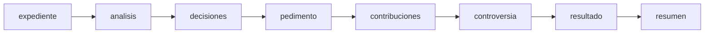
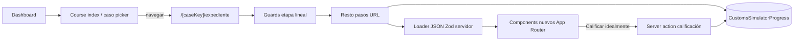

# Refactor: simulador aduanero (prototype → Next.js ANMIN‑CADISA)

Documento fuente único para migrar el prototipo **Lovable / Vite** `utils/prototype/customs-hero-main` al monorepo **Next.js (App Router)**. No se deben copiar los componentes del prototipo (`utils/prototype/customs-hero-main/src/components/`**). El código del prototipo se eliminará con el tiempo. Esta fase es **solo especificación** salvo el bloque **§4.1 y §6.10**, cerrados para iniciar implementación.

---

## 0. Decisiones cerradas para arrancar el refactor

Resumen ejecutable (detalle en §4.1, §6.10, §12).


| Tema                            | Decisión                                                                                                                                                                                                                                                                                                                                                                 |
| ------------------------------- | ------------------------------------------------------------------------------------------------------------------------------------------------------------------------------------------------------------------------------------------------------------------------------------------------------------------------------------------------------------------------ |
| **Identidad del curso**         | `slug`: `simulador-aduanero` · `routePrefix`: `/simulador-aduanero` · nombre visible: **Simulador aduanero** (misma convención que `clasificacion-arancelaria`; testimonios usan `courseSlug: "simulador-aduanero"`).                                                                                                                                                    |
| **Editar una etapa anterior**   | **Invalidar cola**: al guardar cambios en la etapa *S*, eliminar de `completedStages` **todas las etapas posteriores** en el pipeline §6.4; poner `scorePercent` / `evaluatedAt` en `null`; fijar `currentStepSlug` a *S*. Obliga a re‑completar y **vuelve a exigir Calificar** antes de un resultado consistente.                                                      |
| **Caso borrado / despublicado** | **Mínimo esfuerzo**: fuente de `caseKey` válidos = `**case.manifest.json`** (o lista derivada Zod). Si al entrar a `/…/[caseKey]/…` el `caseKey` **no** está publicado → `**redirect`** al listado del curso + `**delete`** de `CustomsSimulatorProgress` para ese `(profileId, caseKey)` en la misma acción servidor (limpieza perezosa, sin tabla `Case` en BD en v1). |
| **Resultado y Resumen**         | Tras completar `controversia` (pipeline), el alumno **debe** ejecutar **Calificar** (`finalizeAttempt`): sin `evaluatedAt` **no** se puede marcar `**resumen`** como accesible/completa. Orden: … → `resultado` (con evaluación obligatoria) → `resumen`.                                                                                                                |
| **Hero / viaje**                | **Sin Three.js en v1** — sustituto ligero en §7 (franja de ruta CSS/SVG).                                                                                                                                                                                                                                                                                                |


---

## 1. Resumen ejecutivo

- **Objetivo pedagógico**: práctica guiada por un expediente ficticio (marítimo, terrestre, aéreo) con cuestionarios, captura de pedimento conceptual, cálculo de contribuciones, controversia aduanera y pantalla de resultado y resumen. En la UI aparece también una experiencia tipo “viaje / operación en tiempo real” con **eventos** que el alumno debe atender antes de avanzar.
- **Decisiones ya fijadas** para implementación: ver **§0** (identidad del curso, edición retroactiva, casos retirados, **Calificar obligatorio** antes de resumen, **sin WebGL** en v1).
- **Marcas / contexto**: el prototipo muestra marca **ANMINCADISA / simulador aduanal**; el destino es el curso dentro de la plataforma ya existente (dashboard, matrícula por slug, mismo patrón que Anexo 22).
- **Navegación en producto (objetivo)**:
  - **Primera página del curso** = **listado de casos** para elegir práctica (sin `WelcomeScreen` del prototipo).
  - Tras seleccionar un caso → **expediente del caso** como “home del caso”: hero/eventos en ruta + ficha inferior con narrativa y metadatos (comportamiento esperado ya validado por diseño UX).
  - **Acceso**: mismo criterio que Anexo 22 / Clasificación — matrícula por **slug** en `Profile.enrolledCourseSlugs` y guard en layout con `**hasCourseAccess`** (detalle §4).
- **Shell UI**: **sin barra lateral** de navegación tipo prototipo; progreso sólo con **stepper/badges** integrados (§5, §7).
- **Stack destino**: **solo Next.js**, sin **React Router** (`BrowserRouter` del prototipo se sustituye por rutas App Router).

---

## 2. Inventario técnico del prototipo (`customs-hero-main`)

### 2.1 Build y rutas cliente


| Aspecto                | Detalle                                                                                                                                |
| ---------------------- | -------------------------------------------------------------------------------------------------------------------------------------- |
| Bundler                | Vite (`[package.json](utils/prototype/customs-hero-main/package.json)`)                                                                |
| Entrada                | `[src/main.tsx](utils/prototype/customs-hero-main/src/main.tsx)` → `[App.tsx](utils/prototype/customs-hero-main/src/App.tsx)`          |
| Enrutado               | **React Router** v6: una ruta `/` → `[pages/Index.tsx](utils/prototype/customs-hero-main/src/pages/Index.tsx)`; catch‑all → `NotFound` |
| UI                     | Tailwind + shadcn‑style primitives bajo `[src/components/ui/](utils/prototype/customs-hero-main/src/components/ui/)`                   |
| Estado remoto opcional | `@tanstack/react-query` (principalmente scaffolding; el flujo simulador es `**SimulatorProvider`** + estado local React)               |


**Implicación para Next.js**: toda navegación del simulador debe ser **layouts + páginas** en `app/`, `**Link`** / redirects del servidor donde aplique — nunca rutas SPA del prototipo.

### 2.2 Flujo principal (`Index.tsx` + contexto)

- `[SimulatorProvider](utils/prototype/customs-hero-main/src/lib/simulator-context.tsx)` concentra: `caseKey`, índice de pantalla dentro de `[SCREEN_IDS](utils/prototype/customs-hero-main/src/lib/simulator-data.ts)`, `answers`, calificación derivada (`submitExam`), navegación `goNext` / `goBack` / `goToScreen`.
- `**WelcomeScreen`** (`[components/screens/WelcomeScreen.tsx](utils/prototype/customs-hero-main/src/components/screens/WelcomeScreen.tsx)`): mientras `started === false`. **En producción esta pantalla NO se usará**. La entrada al curso en Next será el **picker de casos** (ver §5).
- Tras `**startExam()`**, `screenIdx = 1` ⇒ primera pantalla “real” según orden = `case_file` (welcome es índice 0).

### 2.3 Pantallas lógicas (orden en `SCREEN_IDS`)

Definición en `[simulator-data.ts](utils/prototype/customs-hero-main/src/lib/simulator-data.ts)`:


| `ScreenId`          | Título lateral (ES)                                                   |
| ------------------- | --------------------------------------------------------------------- |
| `welcome`           | Bienvenida *(descartado en Next — reemplazado por selección de caso)* |
| `case_file`         | Expediente del caso                                                   |
| `analysis`          | Análisis documental                                                   |
| `decisions`         | Toma de decisiones                                                    |
| `pedimento_capture` | Captura del pedimento                                                 |
| `taxes`             | Cálculo de contribuciones                                             |
| `controversy`       | Controversia aduanera                                                 |
| `validation`        | Resultado *(calificación + mensajes derivados)*                       |
| `summary`           | Resumen del caso                                                      |


Las pantallas concretas bajo `[components/screens/](utils/prototype/customs-hero-main/src/components/screens/)` son referencia comportamental únicamente; **no deben copiarse** al monorepo.

### 2.4 Capas de contenido editorial

Todo el contenido “duro” vive **en TypeScript** hoy:

- **Bundles por caso** en `[cases.ts](utils/prototype/customs-hero-main/src/lib/cases.ts)`: tipos como `CaseInfo`, listas `analysisQuestions`, `decisionQuestions`, `controversyQuestions`, `pedimentoFields`, `taxFields`, `validationRules`, metadatos `mode`, `route`, `isExample`.
- `**JourneyEvent` por caso y por etapa** (clave = string alineado a `screenId` efectivo donde hay evento) en `[MaritimeJourney.tsx](utils/prototype/customs-hero-main/src/components/MaritimeJourney.tsx)` — **no están en `cases.ts`**. Ejemplo conceptual de evento:
  - `id`, `title`, `scenario`, `options[{ label, correct, feedback }]`, iconografía (en el código es clase `LucideIcon`, no portable a JSON literal sin un mapa nombre→componente).
- **Componente `MaritimeJourney`**: además encapsula `@react-three/fiber`, `three`, `drei`: escenas mar/carretera/avión según `caseData.mode`, contador `Eventos: resueltos/total`.

### 2.5 Casos actuales (catálogo de referencia para migración JSON)


| `key`                  | `shortLabel` (UI)             | `isExample` |
| ---------------------- | ----------------------------- | ----------- |
| `maritimo_ejemplo`     | Marítimo · Tabletas (Ejemplo) | `true`      |
| `terrestre_autopartes` | Terrestre · Autopartes        | `false`     |
| `aereo_medico`         | Aéreo · Instrumental médico   | `false`     |
| `maritimo_textil`      | Marítimo · Textiles           | `false`     |


### 2.6 Lógica de puntuación (para replicar o mejorar en servidor)

- `**totalPointsOf**`: suma puntos de quiz + campos pedimento + impuestos (`[cases.ts](utils/prototype/customs-hero-main/src/lib/cases.ts)`).
- `**submitExam**`: suma puntos correctos contra `correctAnswer` / `expected`; convierte a **porcentaje** sobre el máximo; asigna banda textual (`SCORE_BANDS`).
- `**runValidation`**: reglas declarativas que generan mensajes incluso ante respuestas “correctas por puntaje” pero con inconsistencias lógicas (valor en aduana, régimen, etc.).

---

## 3. Deuda técnica observable en el vibe code del prototipo

1. `**CaseFileScreen`**: gran parte del texto narrativo está **hardcodeado** (“ANMINCADISA Imports…”, Shenzhen, orden de párrafos) y no deriva íntegramente de `caseData.case`/`importer`; solo encaja bien con **marítimo ejemplo**. Para los otros modos debe ser **100 % drive‑from‑data** (parámetros o bloques Markdown en contenido editorial).
2. **Separación contenido/UI**: datos de quizzes vs **eventos de viaje** viven archivos distintos; el mapa por pantalla debe unificarse en el **contrato JSON** (ver §9) sin acoplar a Three.js.
3. **Correctas expuestas al cliente**: en el prototipo, `correctAnswer` y `expected` viajan al bundle; para competencias con calificación “seria”, la calificación final debería **preferirse en servidor** (ver §8 — separación servidor/cliente).
4. **Dependencia pesada 3D**: gran impacto en **bundle JS** y accesibilidad; si se conserva visual 3D, debe ir con `**next/dynamic`** (`ssr: false`) según [.agents/skills/vercel-react-best-practices/SKILL.md](../.agents/skills/vercel-react-best-practices/SKILL.md).

---

## 4. Contexto dentro del monorepo Next.js ya existente


| Necesidad                                              | Ubicación en repo                                                                                                                             |
| ------------------------------------------------------ | --------------------------------------------------------------------------------------------------------------------------------------------- |
| Catálogo de cursos disponibles (`slug`, `routePrefix`) | `[lib/constants/courses.ts](lib/constants/courses.ts)`                                                                                        |
| Comprobar acceso a un curso en layout servidor         | `[hasCourseAccess](lib/helpers-server.ts)` + ejemplo `[app/anexo22/layout.tsx](app/anexo22/layout.tsx)`                                       |
| Dashboard portal con tarjetas                          | `[app/dashboard/page.tsx](app/dashboard/page.tsx)`; matrícula vía `**Profile.enrolledCourseSlugs`** (`[schema.prisma](prisma/schema.prisma)`) |
| JSON de otros cursos (**pedimento / Anexo 22**)        | `[lib/data/case-studies/](lib/data/case-studies/)` (`CaseStudy`). **Son un dominio distinto** — no confundir con el simulador aduanero.       |


**Futuro trabajo (no ejecutado en esta fase de documentación)**:

1. Registrar el curso en `[lib/constants/courses.ts](lib/constants/courses.ts)` (`slug` + `routePrefix`, ej. `/simulador-aduanero`) y añadir su **tarjeta** en `[app/dashboard/page.tsx](app/dashboard/page.tsx)` junto a Anexo 22 y Clasificación arancelaria.
2. Crear el árbol `app/<routePrefix>/...` en paralelo a `[app/anexo22](app/anexo22)`.
3. **Control de acceso idéntico al resto de cursos**: en el layout raíz de la ruta del simulador, aplicar el mismo patrón que `[app/anexo22/layout.tsx](app/anexo22/layout.tsx)`:
  - `requireActiveUser` (o equivalente) y
  - `[hasCourseAccess](lib/helpers-server.ts)(profile, "/<routePrefix>")`.
   Un alumno **sólo entra** si su `Profile.enrolledCourseSlugs` incluye el **slug nuevo** del curso (o si `role === "admin"`, según la lógica ya usada en dashboard). Quién no tenga matrícula debe ir a `/dashboard` (u otra ruta coherente con el resto de la plataforma).
4. No se requiere lógica de acceso ad‑hoc para este curso: reutilizar **la misma convención** que Anexo 22 y **Clasificación arancelaria** (`[hasCourseAccess](lib/helpers-server.ts)` + `COURSES`).

### 4.1 Identidad del curso en código *(propuesta cerrada)*

Añadir en `[lib/constants/courses.ts](lib/constants/courses.ts)` una entrada equivalente a:


| Campo en `COURSES` | Valor propuesto                                                              |
| ------------------ | ---------------------------------------------------------------------------- |
| `slug`             | `simulador-aduanero`                                                         |
| `name`             | `Simulador aduanero` *(o “Simulador Aduanero” si preferís mayúsculas en UI)* |
| `routePrefix`      | `/simulador-aduanero`                                                        |


- `**hasCourseAccess(profile, "/simulador-aduanero")`** debe ser el check del layout del curso (misma firma que el resto: `routePrefix` según `COURSES`).

**PortalCard (dashboard)**: título recomendado **Simulador aduanero**; descripción alineada al tono de las otras tarjetas (práctica por casos, expediente, pedimento conceptual, etc.); icono p.ej. `Ship` o `Globe` (coherente con `[PortalCard](components/dashboard/portal-card.tsx)` existente).

**Testimonios**: valor `courseSlug = "simulador-aduanero"` en formularios/validación admin cuando se amplíe la lista permitida.

**Por qué este `slug`**: corto, legible, coexiste con `clasificacion-arancelaria` y `anexo22`; evita acentos en el identificador para URLs y slugs en DB.

---

## 5. Migración conceptual a Next.js (App Router)

### 5.1 Principios generales

- **Sin React Router**. Usar layouts anidados, segmentos dinámicos `**[caseKey]`**, y páginas que reflejan el paso del simulador.
- **Sin sidebar lateral** al estilo del prototipo (`AppSidebar`): la UI usará **un único control de navegación por etapas** (stepper / badges / progress) integrado en la misma cabecera o franja superior del contenido — evitar duplicar “sidebar + indicador de pasos”.
- **Prioridad Server Components**: layouts y páginas como RSC por defecto; `**"use client"`** sólo donde sea inevitable (formularios, canvas/Three, etc.); ver §10.
- **Selección de caso primero**: ruta índice del curso muestra sólo datos **públicos** del catálogo (título corto, ruta geográfica, badge ejemplo). El **bundle completo** puede cargarse al entrar al caso o mediante fetch por servidor.
- **Eliminar equivalencia UX de `welcome`**: el usuario autenticado con acceso al curso ve directamente la lista de casos o un redirect si solo hay un caso publicado.

### 5.2 Propuesta de árbol de rutas (ilustrativo; nombres afinables)


| URL (ejemplo)                              | Rol                                         |
| ------------------------------------------ | ------------------------------------------- |
| `/simulador-aduanero`                      | Lista de casos (homepage del curso)         |
| `/simulador-aduanero/[caseKey]/expediente` | Expediente (+ eventos de ruta de esa etapa) |
| `/simulador-aduanero/[caseKey]/analisis`   | Quiz análisis documental                    |
| `.../decisiones`                           | Decisiones valoración / régimen             |
| `.../pedimento`                            | Captura campos tipo pedimento               |
| `.../contribuciones`                       | Impuestos                                   |
| `.../controversia`                         | Subcaso jurídico                            |
| `.../resultado`                            | Resultados numéricos y validaciones         |
| `.../resumen`                              | Cierre                                      |


Layout del curso: repetir patrón de guard de servidor (`requireActiveUser` + `hasCourseAccess`) igual que `[app/anexo22/layout.tsx](app/anexo22/layout.tsx)`. Dentro de cada caso, **persistencia F5** y **pestañas bloqueadas** en orden lineal: ver §6.

### 5.3 Fuente de verdad entre pasos

- **Preferible**: **URL como paso**, **persistencia en DB** incremental (§11 — `CustomsSimulatorProgress`) como verdad; el cliente sólo para interactividad acotada (§10).
- **Sub-rutas** por etapa; lectura de progreso y validación de acceso a la ruta en **servidor** (`assertStepAccessible`).
- Alineado a [.agents/skills/next-best-practices/SKILL.md](../.agents/skills/next-best-practices/SKILL.md).

---

## 6. Persistencia, refresh, Reiniciar y etapas bloqueadas

El simulador no puede depender sólo del estado en memoria del cliente: **refresh (F5)**, nueva pestaña u otro dispositivo deben reproducir lo que el alumno ya hizo dentro del mismo `caseKey`. Por otro lado, **Reiniciar** debe devolver ese caso al estado inicial de práctica (**Expediente** vacío para ese intento).

### 6.1 Fuente de verdad y refresh (F5)

- La **única fuente autoritativa** del progreso es la fila `**CustomsSimulatorProgress`** (`profileId` + `caseKey`): respuestas, eventos journey resueltos, **etapas completadas**, bookmark de vista y resultado de calificación si aplica (ver §11.2 — campos extendidos incl. `completedStages`).
- **Tras cargar página** (Server Component del layout segment `[caseKey]` o wrapper por etapa): `getOrCreateProgress(profileId, caseKey)` rehidrata el estado “oficial”.
- **La URL debe ser consecuente con el permiso**: si la ruta solicitada (`…/contribuciones`, etc.) no está **desbloqueada**, el servidor ejecuta `**redirect`** hacia una ruta válida:
  - la **bookmark** persistida (`currentStepSlug`), **recortada** si está más avanzada que lo permitido por `completedStages`, o bien
  - la **primera etapa incompleta** del pipeline lineal — que en el caso “frío” o reiniciado es siempre `**expediente`**.
- El cliente puede calcular navegabilidad sólo como **UX**, pero **nunca debe ser la barrera única**: un usuario puede teclear la URL manualmente.

### 6.2 Escritura incremental (guardar mientras trabaja)

- Cada cambio importante debe persistirse con `**patchProgress`** (Server Action idealmente), con `**debounce`** sólo donde haya alta frecuencia (p.ej. teclear libre más adelante; en MVP con selects quiz/boolean es menos crítico).
- Así **cualquier refresh** encuentra datos ya guardados igual que cerrar/abrir navegador.
- Si el alumno tiene **dos pestañas** abiertas con el mismo caso, comportamiento MVP esperado: **última escritura gana** (**LWW** = *last write wins*: el último guardado pisa el campo sin merge automático). Opción futura: **control optimista** (§12.8).

### 6.3 Reiniciar (botón de producto)

`resetSimulatorProgress(profileId, caseKey)` (nombre afinable) como **única vía**:

- `**answers`** → `{}`.
- `**journeyResolved`** → `[]`.
- `**completedStages`** → `[]`.
- `**currentStepSlug`** → `expediente`.
- `**scorePercent`**, `**evaluatedAt`** → `null` (borrar resultado previo si existía).

Tras commit, `**redirect**` a `/…/[caseKey]/expediente`. Otros `**caseKey**` del mismo usuario **no se tocan**. **No** se persiste un historial de intentos anteriores: la única fila `@@unique([profileId, caseKey])` se **sobrescribe** al avanzar y al **Reiniciar** (estado actual únicamente; ver §12.1).

### 6.4 Pipeline lineal oficial de pestañas (slug en URL recomendados)

Al excluir `welcome` del prototipo, orden **bloqueante** (no se desbloquea la etapa siguiente *k + 1* hasta que *k* esté **Completa**):


| Orden | `stepSlug` (URL / persistencia) | Etiqueta UX (ES)               |
| ----- | ------------------------------- | ------------------------------ |
| 1     | `expediente`                    | Expediente del caso            |
| 2     | `analisis`                      | Análisis documental            |
| 3     | `decisiones`                    | Toma de decisiones             |
| 4     | `pedimento`                     | Captura del pedimento          |
| 5     | `contribuciones`                | Cálculo de contribuciones      |
| 6     | `controversia`                  | Controversia aduanera          |
| 7     | `resultado`                     | Resultado *(post “Calificar”)* |
| 8     | `resumen`                       | Resumen del caso               |


**Invariante**: `completedStages` es una lista JSON de `stepSlug` **contigua desde el índice 1**. No se permiten “saltos” (p.ej. `analisis` completo sin haber marcado `expediente`). La validación se hace en servidor al intentar `**markStageComplete`**.

Estado UX por pestaña:

- `**locked`**: anterior no completa → no navegable (`aria-disabled`, sin `href` válido como acción única — o clic muestra mensaje/tooltip).
- `**active`**: etapa permitida donde el alumno trabaja parcialmente.
- `**complete`**: etapa marcada cerrada servidor; permite desbloqueo de la siguiente.

### 6.5 Criterios de completitud por etapa (implementación servidor)

Las reglas finas pueden vivir después en contenido/Zod (**metadatos por etapa**). Baseline esperado sobre el comportamiento conocido del prototipo:


| `stepSlug`       | Cierre de etapa (MVP esperado)                                                                                                                                                                                |
| ---------------- | ------------------------------------------------------------------------------------------------------------------------------------------------------------------------------------------------------------- |
| `expediente`     | **Todos** los `JourneyEvent` configurados para esta etapa + caso están en `journeyResolved` (equiv. contador tipo “Eventos N/M” al 100 %).                                                                    |
| `analisis`       | Todas las preguntas de `analysisQuestions` respondidas según política (**ideal: validación servidor** antes de cerrar — no bastan respuestas vacías donde se exige opción válida).                            |
| `decisiones`     | Idem sobre `decisionQuestions`.                                                                                                                                                                               |
| `pedimento`      | Todos `pedimentoFields` requeridos presentes/sensados y validación contra `expected`/reglas servidor.                                                                                                         |
| `contribuciones` | Idem sobre `taxFields`.                                                                                                                                                                                       |
| `controversia`   | Todas preguntas `controversyQuestions` cerradas igual que quiz.                                                                                                                                               |
| `resultado`      | Generado después de `**finalizeAttempt` / Calificar**: recalcula puntos y guarda mensajes/`validation`-style (idealmente servidor). Esta etapa **no** marca “lista vacía”: implica ejecutar flujo evaluativo. |
| `resumen`        | Accesible **después de** marcarse `resultado` completo/evaluable; modo lectura/recap.                                                                                                                         |


Separar conceptualmente:

- **Completitud de etapa**: desbloquea navegación hacia siguiente.
- **Porcentaje / bandas de desempeño**: salida de `**finalizeAttempt`**, pueden escribirse en `scorePercent` y `evaluatedAt` sin tener que igualar momento exacto del último formulario síncrono más allá del diseño de producto elegido.

### 6.6 APIs servidor mínimas (progresión)

Además del CRUD mencionado en §11.3:


| Función (conceptual)                                        | Rol                                                                                                                                                                     |
| ----------------------------------------------------------- | ----------------------------------------------------------------------------------------------------------------------------------------------------------------------- |
| `canAccessStep(profileId, caseKey, stepSlug)`               | `true` si `stepSlug` ≤ primera etapa incompleta o dentro de rangos revisitables explícitos.                                                                             |
| `markStageComplete(profileId, caseKey, stepSlug, payload?)` | Valida invariantes locales de etapa (**no** permite saltarse previas); añade a `completedStages` si orden correcto y recorta `currentStepSlug` ilegal si hiciese falta. |
| `assertStepAccessible_thenRender`                           | Middleware / helper layout: si falla ⇒ `redirect`.                                                                                                                      |


### 6.7 Contradicción con el prototipo (navegación liberal)

El prototipo permite **saltar libremente** entre pantallas desde su **sidebar**. En este producto: **sin sidebar**, una **única barra de etapas** y **progresión bloqueada hacia adelante** hasta completar la etapa previa; hacia atrás se puede **navegar y modificar** (ver `canAccessStep`, §11.3). Un posible modo sólo **admin/preview** sin bloqueos queda fuera del MVP.

### 6.8 Diagrama de dependencia entre etapas




Etapa siguiente permanece **locked** en UI y servidor hasta que la anterior llega **complete** según §6.5.

### 6.9 Regla cerrada — editar una etapa ya completada (invalidación en cola)

Al persistir cambios en **respuestas o eventos** de una etapa con slug **S** (puede ser una etapa ya marcada como completa):

1. **Truncar `completedStages`**: eliminar de la lista todo slug que venga **después** de *S* en el orden oficial §6.4 (cola invalidada).
2. Poner `**scorePercent`** y `**evaluatedAt`** en `**null`** (debe **volver a Calificar**).
3. Fijar `**currentStepSlug`** en *S* para que el flujo continúe coherentemente desde la etapa editada.

Implementar de preferencia dentro de `**patchProgress*`* al detectar mutación que afecta antiguos pasos. Ver tabla resumen §0.

### 6.10 Calificación obligatoria y acceso a Resumen

- `**finalizeAttempt` (Calificar)** es **obligatoria** para cerrar la etapa `**resultado`** con significado pedagógico: sin `**evaluatedAt`** no se considera evaluación válida.
- La etapa `**resumen`** sólo es accesible / completable cuando `**resultado`** ya refleja esa evaluación (guards de ruta §6.1).

---

## 7. Diseño UX objetivo (capturas acordadas)

1. **Página de entrada del curso**: grid/lista tipo tarjetas con `shortLabel`, subtítulo `{origen} → {destino} · {modo}`, badge **EJEMPLO** dorado donde `isExample`, borde destacado en caso demo.
2. **Dentro del caso** (primer paso = expediente):
  - **Navegación entre etapas**: **no** usar barra lateral tipo prototipo; usar un **único componente de progreso** (badges / stepper / rail horizontal) que muestre las mismas etapas que §6 y sus estados (`locked` / `active` / `complete`).
  - **Sustituto del visor 3D (sin Three.js en v1) — “Franja de ruta”**: bloque hero compacto **CSS + SVG** (sin WebGL):
    - Fondo: degradado acorde al modo (**Marítimo / Terrestre / Aéreo**) + **silueta** estática o **animación CSS** muy suave (olas, carretera, nubes) para dar sensación de movimiento sin canvas.
    - **Trayecto segmentado**: línea o “riel” con **N marcas** = N eventos del stage; cada evento resuelto **rellena** el segmento / muestra **check** y un micro‑acento (respetar `prefers-reduced-motion`).
    - Cabecera de texto: *Operación en tiempo real · {origen} → {destino}* y contador **Eventos k/N** (equivalente funcional al prototipo, menos peso y más accesible).
    - Opcional: un **emoji/figura** temática discreta (ancla, camión, avión) como capa SVG — mantiene un tono “divertido” sin depender de librerías 3D.
  - Modal o panel accesible para la pregunta del evento (client mínimo si hace falta).
  - Zona inferior: tarjeta con tags, título `case.title`, narrativa y mini‑stats (aduana destino, valor comercial USD, etc.).
3. **Sin `WelcomeScreen`**: nombre de alumno/grupo pueden integrarse después vía cuenta de usuario o campo opcional dentro del caso, no pantalla inicial bloqueante.

---

## 8. Separación servidor / cliente por seguridad editorial

Para evitar trampas triviales (“ver la correcta” en DevTools):


| Información                                              | Dónde debe vivir al implementar                                              |
| -------------------------------------------------------- | ---------------------------------------------------------------------------- |
| Etiquetas, textos preguntas, opciones ordenadas          | Payload “público” o RSC hasta el cliente OK                                  |
| `correctAnswer`, `expected`, pesos puntos si es sensible | Preferible **solo servidor** o servidor + envío tardío hasta “Calificar”     |
| Reglas avanzadas de validación                           | Ejecutadas en servidor como en `runValidation`, con mismos datos que quizzes |


El documento anterior no impide un MVP cliente‑only igual al prototipo, pero debe **explicitarse como deuda técnica** hasta mover calificación **server‑side**.

---

## 9. Contenido en JSON obligatorio validado con Zod

**Requisito duro cuando se implemente**: todo contenido cargado desde disco (**y eventualmente ingestión**) debe pasar por `**z.safeParse`** o `parse` contra **esquemas Zod** versionados antes de llegar al render. Objetivos: fallar en **bootstrap** (deploy/CI) o en **primer request servidor** con log estructurado, no lanzar errores aleatorios en runtime en el navegador.

### 9.1 Estructura de archivos recomendada (propuesta)

```
lib/
  data/
    customs-simulator/
      schema-version.json          # ej. { "version": 1 }
      cases/
        maritimo_ejemplo.json
        terrestre_autopartes.json
        ...
      journey/
        maritimo_ejemplo.json      # eventos por stage / screen key
      ...
```

- **Versión única**: un entero/string en `schema-version.json`; los esquemas Zod exigen ese campo donde aplique (`contentSchemaVersion`).
- **Punto único de carga**: módulos “loader” servidor `loadCaseBundle(caseKey)` → `assertCaseBundle(json)` usando Zod → tipo inferido (`z.infer<typeof CaseBundleSchema>`).

### 9.2 Reglas prácticas de modelado para Zod

- **Íconos de eventos**: en JSON usar **nombre string** estable (`"file-text"`) y en app un **mapa** `RECORD<string, IconComponent>`; no persistir tipos función.
- `**enum`/union discriminada** para `mode`, `severity`, `screenId` de navegación, tipos `FormField`.
- `**superRefine` / cross-field** para garantizar unicidad `question.id`, existencia campos pedimento esperados donde reglas los referencien.
- **CI**: script tipo `pnpm ts-node scripts/validate-customs-data.ts` que recorra `lib/data/customs-simulator/**/*.json` y `**process.exit(1)`** ante fallos (complementario a cualquier Vitest específico).

### 9.3 División público vs privado (opción avanzada)

- Archivo público `**case.manifest.json`** (metadatos listado picker + caseKey válidos).
- Archivo servidor `**answers.server.json`** o columna DB con soluciones — no importado en Client Components.

---

## 10. Estándares de implementación obligatorios (post‑Markdown)

Al escribir código en el monorepo, seguir **obligatoriamente**:

1. **Predominio de Server Components**: por defecto, layouts y páginas del simulador como **RSC**; hidratar sólo islas cliente (formularios, modal de eventos, animaciones que requieran estado local). **No** usar Three/R3F en v1 (§7).
2. **Next.js rendimiento / App Router**: [.agents/skills/next-best-practices/SKILL.md](../.agents/skills/next-best-practices/SKILL.md) — fetching en paralelo, límites de RSC/`"use client"`, cachés `React.cache` donde aplique, etc.
3. **React y bundle cliente**: [.agents/skills/vercel-react-best-practices/SKILL.md](../.agents/skills/vercel-react-best-practices/SKILL.md) — evitar cascadas de `await`; si en el futuro se reintroduce escena pesada, `dynamic`/`import()` + evaluar impacto.
4. **Composición de componentes**: [.agents/skills/vercel-composition-patterns/SKILL.md](../.agents/skills/vercel-composition-patterns/SKILL.md) — evitar proliferación boolean props en shell **sin sidebar**, stepper de etapas, expediente y formularios; preferir compound components/context acotados al subtree del curso.

---

## 11. Backend y base de datos — línea base (Prisma)

### 11.1 Separación respecto a `UserAttempt` (Anexo 22 / pedimento)

- `**UserAttempt`** (`[prisma/schema.prisma](prisma/schema.prisma)`) es **solo** para el curso pedimento / Anexo 22 (`caseStudyId` ↔ casos en `[lib/data/case-studies/](lib/data/case-studies/)`). **No reutilizar** ni mezclar filas con el simulador: dominio y ciclo de vida distintos.
- El simulador usa **exclusivamente** `**CustomsSimulatorProgress`** (y tablas futuras **solo de este curso** si hicieran falta). Mantener **todas** las tablas “de curso” **separadas**; lo único compartido es lo transversal: `**Profile`**, matrícula (`enrolledCourseSlugs`), guards, `**Testimonial`** con nuevo slug, etc.

### 11.2 Modelo propuesto MVP — `CustomsSimulatorProgress` (nombre afinable)

Propósito: **única fila viva** por usuario y caso (reanudar navegación tras **refresh**); **no hay tabla de historial de intentos**: al **Reiniciar** se resetea la misma fila. Soporte de **progresión por etapas** (§6). Campos MVP:

```prisma
model CustomsSimulatorProgress {
  id               String    @id @default(cuid())
  profileId        String
  profile          Profile   @relation(fields: [profileId], references: [id], onDelete: Cascade)

  /// caseKey estable (coincide con JSON + URL segment)
  caseKey          String

  /// última URL lógica o enum — ver pipeline §6.4 (`expediente`, `analisis`, …); debe ser coherente con etapas desbloqueadas
  currentStepSlug  String

  /// respuestas agregadas: quiz IDs, field IDs como claves planas (véase escritura incremental §6.2)
  answers          Json      @default("{}")

  /// ids de JourneyEvent resueltos (segunda ronda puede estructurar por `stepSlug`)
  journeyResolved  Json      @default("[]")

  /// etapas completadas en orden **contiguo** desde `expediente`, p.ej. ["expediente","analisis"] — invariante §6.4
  completedStages  Json      @default("[]")

  /// porcentaje 0–100 tras Calificar (idealmente servidor)
  scorePercent     Int?

  evaluatedAt      DateTime?

  createdAt        DateTime  @default(now())
  updatedAt        DateTime  @updatedAt

  @@unique([profileId, caseKey])
  @@index([profileId])
  @@index([caseKey])
}
```

Actualizar modelo `[Profile](prisma/schema.prisma)` con:

```prisma
customsSimulatorProgress CustomsSimulatorProgress[]
```

### 11.3 Operaciones servidor típicas (cuando exista código)


| Acción                                                      | Comportamiento                                                                                                                                               |
| ----------------------------------------------------------- | ------------------------------------------------------------------------------------------------------------------------------------------------------------ |
| `getOrCreateProgress(profileId, caseKey)`                   | findUnique por `profileId_caseKey`; seed vacío coherente con §6 (`currentStepSlug` = `expediente`, arrays vacíos)                                            |
| `patchProgress(patch)` *(nombre afinable)*                  | merge atómico de `answers`, `journeyResolved`, `currentStepSlug` cuando no viola gates de etapa                                                              |
| `markJourneyEventResolved(profileId, caseKey, eventId)`     | idempotente; usado antes de poder **marcar** `expediente` como completa si faltaban eventos                                                                  |
| `resetSimulatorProgress(profileId, caseKey)`                | Reiniciar: limpia `answers`, `journeyResolved`, `completedStages`; `currentStepSlug` → `expediente`; borra métricas de resultado; redirect §6.3              |
| `canAccessStep(profileId, caseKey, stepSlug)`               | Además de bloqueo **hacia adelante** §6.4: etapas ya completadas o anteriores a la “frontera” permiten **volver**; al guardar con cambios, aplicar **§6.9**. |
| `markStageComplete(profileId, caseKey, stepSlug, payload?)` | Validación servidor de cierre §6.5; garantiza orden contiguo de `completedStages`                                                                            |
| `assertStepAccessible` *(layout/route guard)*               | Si URL no permitida → `redirect` a paso válido §6.1                                                                                                          |
| `finalizeAttempt(profileId, caseKey)`                       | Recalcula puntuación, escribe `scorePercent`/`evaluatedAt`; habilita cierre `**resultado`** según política §6.5                                              |


Indices sugeridos listados arriba; si muchos escrituras concurrentes, evaluar uso de `**updateMany`** con versioning (optimista) en **segunda iteración BD**.

---

## 12. Decisiones de producto y temas aclarados (antes “abiertos”)

Lo siguiente reemplaza la lista interrogativa anterior: **resoluciones** y **glosario** donde hacía falta detalle.

### 12.1 Intentos y historial

- **Un solo estado activo por usuario y caso**: la fila `CustomsSimulatorProgress` con `@@unique([profileId, caseKey])` es la **única** verdad actual. **No** hay historial de intentos archivados en DB: no tabla tipo `CustomsSimulatorAttempt` en el alcance descrito.
- **Reiniciar** arranca de cero **reutilizando la misma fila** (mismos límites únicos); no se conservan snapshots viejos.

### 12.2 Telemetría (qué es y estado)

- **Qué es**: medición de **tiempos por etapa**, **abandonos**, embudos de uso, etc., con fines de mejorar el curso o el contenido.
- **Estado**: **fuera del MVP** aquí descrito, salvo decisión explícita más adelante (eventos de producto, tabla auxiliar, privacidad).

### 12.3 Soft delete / archivado de **casos del simulador** *(cerrado — política mínima)*

- Los `caseKey` publicados se listan en `**case.manifest.json`** (o derivado validado Zod) dentro del repo o build.
- **Si un `caseKey` deja de existir** en ese manifiesto (borrado de JSON / retirada del catálogo): al resolver cualquier request a `/<routePrefix>/[caseKey]/...`, el servidor comprueba pertenencia al manifiesto; si **no** es válido → `**redirect`** a `/<routePrefix>` y `**delete`** de la fila `CustomsSimulatorProgress` con ese `(profileId, caseKey)`.
- Sin tabla `Case` en PostgreSQL en v1: **mínimo código**, sin cascadas FK complejas.

### 12.4 Auditoría de contenido (explicación)

- `**createdBy` / `publishedAt`**: trazabilidad de **quién** publicó o cambió un caso y **cuándo** quedó disponible a estudiantes.
- **Versionado o hash del JSON**: reproducir qué **versión** del contenido respondió el alumno y auditar cambios en el material (útil si el JSON evoluciona).
- **Estado**: mejora operativa posterior; el contrato §9 ya permite crecer hacia versiones etiquetadas.

### 12.5 Grupificación (explicación explícita)

- En la plataforma, los `**Group`** del modelo Prisma suelen usarse con **vídeos** por curso (p. ej. un grupo de alumnos ve ciertos vídeos de Anexo 22 según su pertenencia).
- **Pregunta abierta para implementación**: si el simulador usará **el mismo mecanismo** para mostrar **sólo algunos casos** según grupo de clase, o bastará con `**Profile.enrolledCourseSlugs`** para el curso completo. **MVP probable**: igual que Anexo 22 / Clasificación — **acceso por slug de curso**; filtro extra por `Group` sólo si reglas de negocio lo piden.

### 12.6 Estadísticas globales para administradores

- **No** incluidas en el alcance descrito.

### 12.7 Testimonios (`Testimonial`)

- **Sí**: extender valores de `courseSlug` para admitir `**simulador-aduanero`** (ver §4.1 y `[COURSES](lib/constants/courses.ts)`).

### 12.8 Concurrencia: LWW vs optimista (glosario)

- **LWW (*last write wins*)**: si dos sesiones guardan, **predomina el último guardado**; simple, puede pisar cambios del otro cliente.
- **Optimista (*compare-and-swap*)**: el servidor sólo acepta el guardado si el **número de versión** (`version` o comparación de `updatedAt`) coincide; si no, se rechaza y el cliente debe **recargar o fusionar**.

### 12.9 Volver a etapas anteriores y editar *(cerrado)*

- **Permitido** regresar a etapas anteriores y **seguir editando** (no es flujo sólo lectura).
- Consistencia: al guardar cambios en una etapa anterior se aplica la **invalidación en cola** §6.9 (se eliminan completaciones posteriores y la calificación hasta nuevo **Calificar**).

---

Lo que **sí** quedó abierto en §12 (telemetría, auditoría editorial avanzada, grupos por caso) no bloquea el **primer vertical slice**; lo demás ya está **decidido** en §0 y subapartados *cerrado*.

---

## 13. Diagrama alto nivel — flujo y persistencia




---

## 14. Roadmap después de cerrar esta especificación

Orden recomendado (fuera del alcance de **este** archivo salvo mención):

1. Añadir `slug`/ruta nuevo en `[COURSES](lib/constants/courses.ts)` + nueva **PortalCard** en `[dashboard/page.tsx](app/dashboard/page.tsx)`.
2. Crear `app/<route>/...` con **layout que valide acceso** como `[app/anexo22/layout.tsx](app/anexo22/layout.tsx)`: `requireActiveUser` + `[hasCourseAccess](lib/helpers-server.ts)(profile, routePrefix del curso)`; matrícula por `enrolledCourseSlugs` (§4).
3. Exportar contenido TS del prototipo a JSON bajo §9 — **pasar todos por Zod** en CI.
4. Migración Prisma `CustomsSimulatorProgress` (+ relación Profile).
5. UI incremental: picker → expediente con **Franja de ruta** (§7, sin Three.js) → demás pasos con **bloqueo lineal, invalidación §6.9 y guards §6**.
6. Mover calificación decisiva a servidor.
7. Eliminar carpeta prototipo cuando el monorepo no dependa de ella.

**Desglose en fases mergeables** (orden, criterios de “hecho” y riesgos): **§16**.

---

## 15. Checklist rápido de “listo primera implementación código”

- JSON de casos + journey presentes y **validados por Zod** en script CI.
- Curso visible en dashboard para roles que correspondan.
- Picker sin `WelcomeScreen`; deep link a expediente funcionando tras elegir caso.
- **Acceso al curso** verificado como Anexo 22 / Clasificación: `[hasCourseAccess](lib/helpers-server.ts)` + `enrolledCourseSlugs` (§4).
- UI **sin sidebar** lateral tipo prototipo; sólo **stepper/badges** de etapas (§5, §7).
- **Server Components** por defecto en layouts/páginas del simulador; islas cliente mínimas (§10).
- `CustomsSimulatorProgress` creándose sin errores; **save progresivo** ante interacciones (§6); **refresh / F5** recupera mismo estado.
- `**assertStepAccessible` / redirects**: rutas más allá del paso permitido llevan siempre al paso válido (manual URL incluido).
- **Pestañas / navegación lineal**: etapas futuras sólo clicables/desbloqueadas tras completar anterior (servidor como fuente de verdad, §6).
- `**resetSimulatorProgress`** deja Expediente reseteado como en §6; no afecta otros `caseKey`.
- Ningún import vivo desde `utils/prototype/customs-hero-main/src/components`.
- Directrices [.agents/skills/next-best-practices/SKILL.md](../.agents/skills/next-best-practices/SKILL.md), [.agents/skills/vercel-react-best-practices/SKILL.md](../.agents/skills/vercel-react-best-practices/SKILL.md), [.agents/skills/vercel-composition-patterns/SKILL.md](../.agents/skills/vercel-composition-patterns/SKILL.md) aplicadas durante code review antes de merge.

---

## 16. Implementación por fases (recomendación operativa)

**Por qué no “todo a la vez”**: el alcance cruza **configuración de producto**, **rutas**, **contenido JSON+Zod**, **Prisma**, **Server Actions**, **guards** y **UI** del simulador; un único cambio masivo dificulta revisión, pruebas y rollback. Estas fases permiten **mergear valor incremental** y acotar fallos.

Cada fase debería cerrar con: **PR revisable**, **criterio de aceptación** claro y, si aplica, **smoke test** manual (matrícula / no matrícula).

### Fase 1 — Shell del curso y control de acceso

- Añadir entrada en `[lib/constants/courses.ts](lib/constants/courses.ts)` (**§4.1**), **PortalCard** en `[app/dashboard/page.tsx](app/dashboard/page.tsx)`.
- Crear `app/simulador-aduanero/` (o el `routePrefix` definitivo): **layout** con `requireActiveUser` + `[hasCourseAccess](lib/helpers-server.ts)` como `[app/anexo22/layout.tsx](app/anexo22/layout.tsx)`.
- Página índice mínima (p.ej. título del curso + placeholder o lista vacía).
- **Hecho cuando**: un usuario **con** el slug en `enrolledCourseSlugs` entra a `/simulador-aduanero`; **sin** matrícula es redirigido como en otros cursos.

### Fase 2 — Contenido en repo + Zod + picker de casos

- Estructura `[lib/data/customs-simulator/](lib/data/customs-simulator/)` (**§9**), `**case.manifest.json`**, al menos **un** caso piloto validado con Zod.
- Script CI / comando `pnpm` que falle si JSON inválido.
- Vista **lista de casos** (RSC) leyendo manifiesto/metadatos públicos; navegación a `/simulador-aduanero/[caseKey]/expediente`.
- **Hecho cuando**: tarjetas de casos reales y enlace al expediente (persistencia puede ser mínima o stub).

### Fase 3 — Persistencia mínima (`CustomsSimulatorProgress`)

- Migración Prisma (**§11.2**), relación en `Profile`.
- `getOrCreateProgress`, `patchProgress` (merge de `answers` / `journeyResolved` / `currentStepSlug`) y `**resetSimulatorProgress`** (**§11.3**).
- **Hecho cuando**: **F5** conserva estado y **Reiniciar** limpia el registro (**§6**).

### Fase 4 — Primer vertical slice dentro de un caso

- **Franja de ruta** (**§7**), panel/modal de **eventos** de expediente, persistencia de `journeyResolved`.
- **Una** segunda etapa cableada (p.ej. `analisis`) con quiz mínimo + guardado.
- **Guards** `assertStepAccessible` / redirect si la URL va demasiado adelante (**§6.1**).
- **Hecho cuando**: flujo real expediente → (cierre §6.5) → análisis, bloqueo de etapas futuras, sin tocar `UserAttempt` (**§11.1**).

### Fase 5 — Resto de etapas e invalidación §6.9

- Rutas y UI para `decisiones` … `resumen` según pipeline **§6.4**.
- **Invalidación en cola** al editar etapas anteriores (**§6.9**) en `patchProgress` o acción dedicada.
- `markStageComplete` / `completedStages` contiguos.
- **Hecho cuando**: recorrido completo con datos de prueba; vuelta atrás invalida la cola y obliga a recalificar cuando corresponda.

### Fase 6 — Calificación obligatoria y cierre

- `finalizeAttempt` **en servidor**; `evaluatedAt` / `scorePercent`; **§6.10** — sin calificar, **resumen** no válido.
- Pantallas **resultado** y **resumen**.
- **Hecho cuando**: un caso piloto termina con resultado + resumen coherentes.

### Fase 7 — Cierre producto y limpieza

- **Testimonios**: `courseSlug` `**simulador-aduanero`** (**§12.7**, **§4.1**).
- Request: `caseKey` ∉ manifiesto → redirect + **delete** de progreso (**§12.3**).
- Eliminar `**utils/prototype/customs-hero-main`** cuando no haya imports (**§14** ítem 7).

### Paralelo / posterior (no bloquean el núcleo)

- Telemetría (**§12.2**), auditoría rica (**§12.4**), filtrado por `Group` por caso (**§12.5**), optimista vs LWW (**§12.8**).

**Relación con §14**: el roadmap numerado es el **orden lógico**; esta §16 **agrupa** entregas **mergeables** por PRs sucesivas.